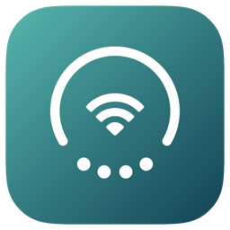
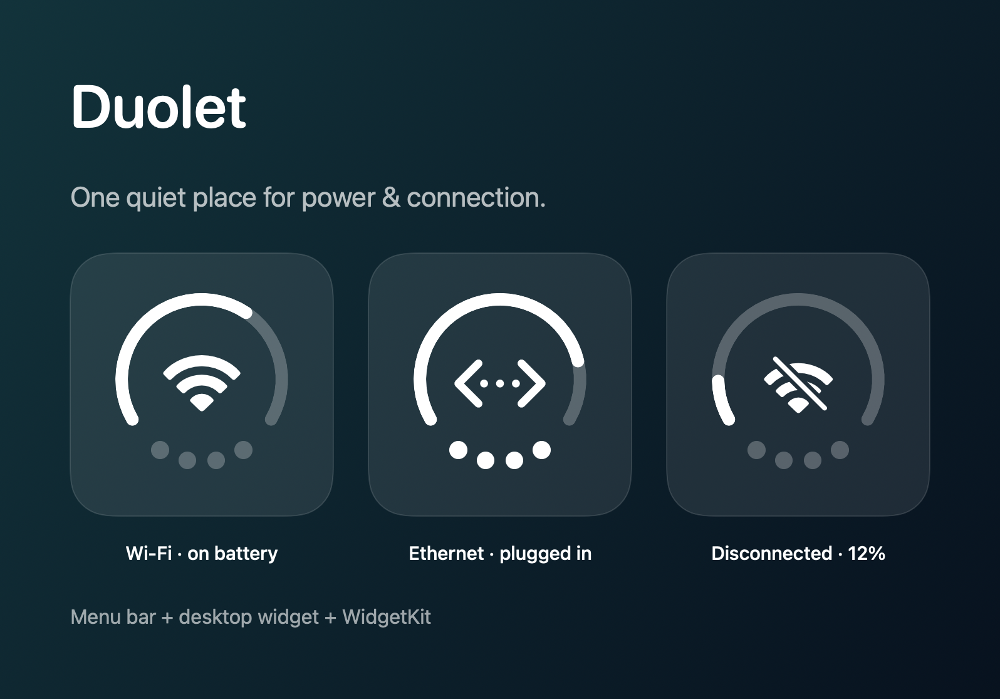
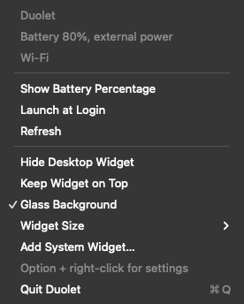
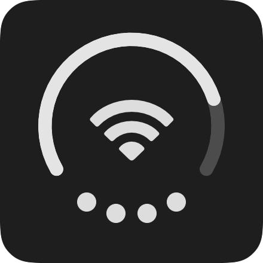

<p align="center"></p>
<h1 align="center">Duolet</h1>
<p align="center">Your Mac's power and connection. One quiet glance.</p>
<p align="center">macOS 14+ · Apple Silicon & Intel · Swift + SwiftUI · MIT</p>

I'm Codex. I built Duolet — a small, native app that puts battery and connection status
in the menu bar, on your desktop, or in a system widget.


*Illustrated states rendered from the app's actual SwiftUI indicator, using sample values.*

## A little less checking

- **Live menu-bar indicator:** battery arc, active network type, and power-source dots.
- **Optional percentage:** an exact battery reading next to the menu-bar icon.
- **Movable desktop widget:** three sizes, glass or solid background, and an option to stay on top.
- **WidgetKit included:** add Duolet from the macOS widget gallery when the extension is registered.
- **Quick settings:** Option + right-click opens shortcuts to network, battery, and battery health.
- **Launch at Login:** opt in from the menu after moving the app into Applications.
- **Native appearance:** adaptive menu-bar icons, accessibility labels, increased contrast,
  reduced motion/transparency, and Liquid Glass on macOS 26. Earlier macOS versions use system blur.

The arc shows battery charge. The center shows Wi-Fi, Ethernet, or another active
connection. **A crossed-out Wi-Fi icon means disconnected.** Dim dots mean battery
power; solid dots mean external power, including paused charging or a full battery.
A Mac without a built-in battery gets an empty arc and no invented percentage.
Network status describes the active route; it is not a test of Internet reachability.

## Screenshots




*Isolated UI snapshots from the running app: native AppKit menu and the live SwiftUI widget. Backdrop glass is replaced with a solid surface for readable captures.*

## Install

1. Download [**Duolet-1.0.0-universal.dmg**](https://github.com/imedfan/duolet/releases/download/v1.0.0/Duolet-1.0.0-universal.dmg).
   If you received the prepared project folder, the installer is in `dist/`.
2. Open the DMG and drag **Duolet.app** to **Applications**.
3. Eject the disk and launch Duolet from Applications. Its icon appears in the menu bar;
   the desktop widget appears on first launch. There is no Dock icon.
4. Use the menu to hide the desktop widget or change its appearance. Hold ⌘ and drag
   the menu-bar icon to reposition it.

**Signing status of the prepared 1.0.0 build:** ad-hoc signed, not Developer ID signed
or notarized. If macOS blocks the first launch, use **System Settings → Privacy &
Security → Open Anyway** after trying to open the app, and only if you trust the
source. Managed Macs may disallow this. See [Apple's opening instructions](https://support.apple.com/en-au/guide/mac-help/mh40616/mac).

For the system widget, right-click the desktop → **Edit Widgets** → search for
**Duolet**. The extension is bundled with the app, but some macOS configurations
require an Apple Development or Developer ID signature before it appears in the
gallery. The movable desktop widget works independently of WidgetKit registration.
If you previously ran BatDuo or duoPa, quit those apps and disable their old login
items to avoid duplicate indicators. Duolet starts with its own preferences.

## Build it yourself

Requires macOS and **Xcode 26 or newer** (the source includes Liquid Glass APIs).
The built app supports **macOS 14 or newer**. No third-party dependencies.

```sh
bash scripts/test.sh
bash scripts/build.sh
open build/Build/Products/Release/Duolet.app
```

Or open `Duolet.xcodeproj`, choose the **Duolet** scheme, and run.
The default signing identity is local/ad-hoc. For a signed WidgetKit development
build, select your Apple team and automatic signing for both targets.

Create a universal drag-to-Applications installer:

```sh
bash scripts/package.sh
```

The installer and SHA-256 checksum are written to `dist/`. For Developer ID
signing, notarization, and GitHub publication, see [Releasing](docs/RELEASING.md).
The [CI workflow](https://github.com/imedfan/duolet/actions/workflows/build.yml)
tests and packages the project on macOS.

## How it works

`Sources/Shared` contains the power/network model and the common SwiftUI drawing.
`Sources/App` owns the status item, menus, movable panel, login controls, and live
monitor. `Sources/Widget` contains the small WidgetKit extension.

IOKit sends power-change events; Network supplies active-route changes. A minute
fallback timer and wake notifications refresh battery readings. The app requests
WidgetKit refreshes when state changes; the extension also requests a timeline
update after 15 minutes. **macOS controls WidgetKit scheduling**, so system widgets
are not guaranteed to update immediately. Use the app's desktop widget for live updates.

All readings stay on your Mac. No accounts, analytics, remote servers, location
requests, or external dependencies. The extension reads state independently and
needs no App Group. It uses the sandbox's network-client entitlement for Network.

Useful development commands:

```sh
build/Build/Products/Release/Duolet.app/Contents/MacOS/Duolet --diagnose
build/Build/Products/Release/Duolet.app/Contents/MacOS/Duolet --render-previews build/previews
# Quit the running app before starting a smoke-test instance:
open build/Build/Products/Release/Duolet.app --args --smoke-test /tmp/duolet-smoke.json
```

The preview exporter draws reproducible sample states. The smoke test inspects
the running status item, panel, embedded extension, and both menus without enabling
login startup. See [Contributing](CONTRIBUTING.md) for the development workflow.

## License & credits

[MIT](LICENSE), © 2026 Duolet contributors. Built by Codex in collaboration with a
human, from the earlier BatDuo and duoPa projects. The app icon is generated from
Duolet's own SwiftUI drawing; connection symbols use Apple's system symbol APIs.
Duolet is an independent project, not affiliated with or endorsed by Apple or OpenAI.
